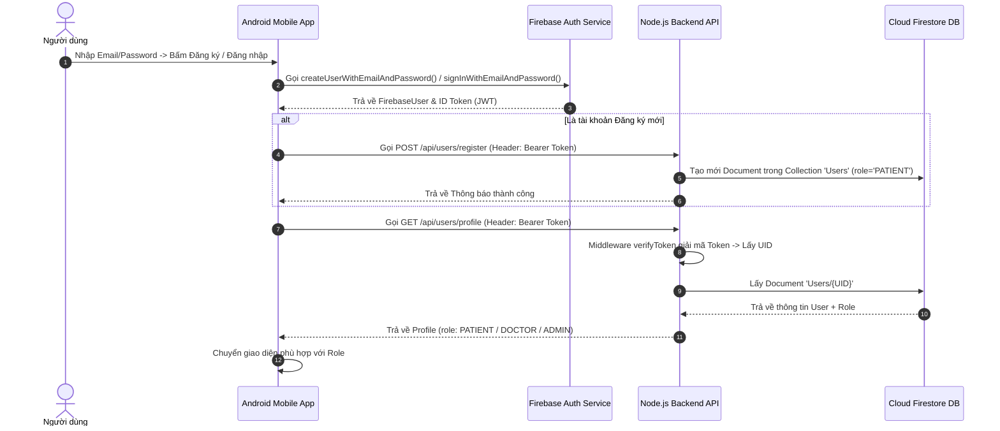
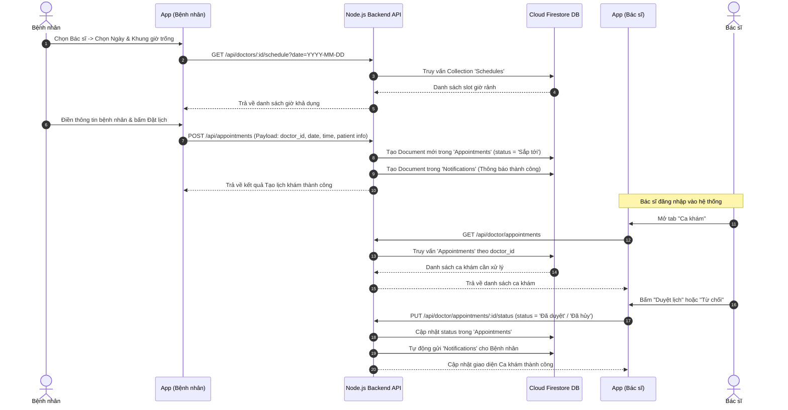

# TÀI LIỆU KỸ THUẬT VÀ KIẾN TRÚC HỆ THỐNG HEALTHBOOK

Tài liệu này giải thích chi tiết cặn kẽ về cách hoạt động, kiến trúc công nghệ, các kết nối cơ sở dữ liệu và các luồng nghiệp vụ (workflows) của dự án **HealthBook**.

---

## 1. TỔNG QUAN KIẾN TRÚC HỆ THỐNG (SYSTEM ARCHITECTURE)

Dự án HealthBook được xây dựng theo mô hình **Monorepo** với kiến trúc **Client-Server (Frontend Mobile & Backend REST API)** kết hợp với **Firebase Cloud Services**.

```
┌──────────────────────────────────────────────────────────────────────────┐
│                             MOBILE APP (CLIENT)                          │
│                                                                          │
│  Android Native (Java) - Single-Activity (MainActivity + NavGraph)       │
│  ┌───────────────────────┬────────────────────────┬───────────────────┐  │
│  │   Bệnh nhân (Patient) │   Bác sĩ (Doctor)      │   Quản trị (Admin)│  │
│  └───────────────────────┴────────────────────────┴───────────────────┘  │
│             │                                          │                 │
│  Retrofit2 (HTTP REST)                         Firebase SDK (Realtime)   │
└─────────────┼──────────────────────────────────────────┼─────────────────┘
              │ (Authorization: Bearer <ID_Token>)       │
              ▼                                          │
┌───────────────────────────────────────────┐            │
│            BACKEND API (SERVER)           │            │
│                                           │            │
│  Node.js + Express.js Framework           │            │
│  - Middleware: Auth (Firebase Admin SDK)  │            │
│  - Routes: /api/users, /api/doctor, ...   │            │
└─────────────────────┬─────────────────────┘            │
                      │                                  │
                      ▼                                  ▼
┌──────────────────────────────────────────────────────────────────────────┐
│                             FIREBASE SERVICES                            │
│                                                                          │
│  ┌─────────────────────────────┐        ┌─────────────────────────────┐  │
│  │   Firebase Authentication   │        │     Cloud Firestore Database│  │
│  │   (Xác thực & Phát hành JWT)│        │     (NoSQL Database Engine) │  │
│  └─────────────────────────────┘        └─────────────────────────────┘  │
└──────────────────────────────────────────────────────────────────────────┘
```

---

## 2. CÔNG NGHỆ SỬ DỤNG VÀ KẾT NỐI (TECH STACK & INTEGRATIONS)

### 2.1. Frontend (Ứng dụng Di động Android)
* **Ngôn ngữ & Nền tảng**: Java (Android SDK 8.0 / API 26+).
* **Kiến trúc UI**: Single-Activity Pattern dùng `MainActivity`, điều hướng màn hình linh hoạt thông qua **Android Jetpack Navigation Component** (`nav_graph.xml`).
* **Mạng & HTTP Client**:
  * **Retrofit2**: Khởi tạo RESTful API Client gửi/nhận dữ liệu JSON.
  * **Gson Converter**: Tự động chuyển đổi qua lại giữa JSON và các Data Model Java (`User`, `Appointment`, `Doctor`, `MedicalRecord`, v.v.).
  * **OkHttp3 Interceptor**: Tự động chặn mọi HTTP Request chuẩn bị gửi đi, chèn Firebase Auth ID Token vào Request Header dưới dạng `Authorization: Bearer <Token>`.
* **Dịch vụ Firebase Client**:
  * **Firebase Auth**: Quản lý phiên làm việc, đăng nhập/đăng ký trực tiếp với Google Firebase Auth Server.
  * **Firebase Firestore Realtime Listener**: Nhận tin nhắn Chat ngay lập tức (`addSnapshotListener`) mà không cần qua Server Node.js trung gian.

### 2.2. Backend API Server
* **Nền tảng**: Node.js (v18+ / Express.js v5).
* **Cơ chế Xác thực Auth**: **Firebase Admin SDK** (`firebase-admin/auth`).
  * Middleware `verifyToken`: Giải mã Firebase JWT ID Token từ Client, xác minh tính hợp lệ và lấy `uid`.
  * Middleware `requireRole(role)`: Truy vấn danh mục người dùng để đảm bảo đúng quyền truy cập (`PATIENT`, `DOCTOR`, `ADMIN`).
* **Lưu trữ & Tải lên tập tin**: `Multer` (lưu trữ ảnh đại diện, avatar tải lên vào thư mục `public/uploads`).

### 2.3. Cơ sở dữ liệu (Cloud Firestore NoSQL)
Hệ thống sử dụng **Google Cloud Firestore** dạng Tài liệu (Document-based NoSQL Database) giúp mở rộng linh hoạt.

---

## 3. CƠ SỞ DỮ LIỆU & CÁC TẬP HỢP TÀI LIỆU (DATABASE COLLECTIONS)

| Collection Name | Document ID Key | Các trường dữ liệu chính (Fields) | Mô tả & Mối liên kết |
| :--- | :--- | :--- | :--- |
| **`Users`** | `UID` (từ Firebase Auth) | `email`, `displayName`, `phone`, `dob`, `gender`, `address`, `role` (`PATIENT`/`DOCTOR`/`ADMIN`), `status` (`active`/`banned`), `insuranceCode`, `insuranceExpiry`, `hospitalRegister`, `relativeName`, `relativePhone`, `weight`, `height` | Quản lý toàn bộ hồ sơ người dùng trong hệ thống. |
| **`Doctors`** | Auto-generated ID | `user_id` (Link UID từ Users), `name`, `email`, `specialty`, `hospital`, `rating`, `reviewCount`, `experience`, `price`, `description`, `imageUrl` | Lưu danh sách thông tin chi tiết của Bác sĩ. Liên kết `user_id` với `Users`. |
| **`Appointments`** | Auto-generated ID | `patient_id` (UID Bệnh nhân), `doctor_id` (ID Bác sĩ), `doctorName`, `specialty`, `hospital`, `appointment_date`, `appointment_time`, `status` (`Sắp tới`/`Đã duyệt`/`Đã hủy`/`Đã qua`), `type`, `patient_name`, `patient_phone`, `patient_dob`, `patient_gender`, `created_at` | Quản lý lịch hẹn khám chữa bệnh. Khóa ngoại ảo: `patient_id` -> `Users.id`, `doctor_id` -> `Doctors.id`. |
| **`MedicalRecords`** | Auto-generated ID | `patient_id`, `doctor_id`, `appointment_id`, `doctor_name`, `diagnosis`, `prescription`, `notes`, `created_at` | Hồ sơ bệnh án & đơn thuốc do Bác sĩ lập sau khi hoàn tất ca khám. |
| **`Vaccines`** | Auto-generated ID | `name`, `price`, `disease`, `requiredDoses`, `ageGroup` | Danh mục vắc-xin tiêm chủng. |
| **`VaccineBookings`** | Auto-generated ID | `patient_id`, `vaccine_id`, `vaccine_name`, `price`, `appointment_date`, `appointment_time`, `status`, `created_at` | Đơn đặt lịch tiêm chủng vắc-xin của bệnh nhân. |
| **`Notifications`** | Auto-generated ID | `user_id`, `title`, `body`, `type` (`APPOINTMENT_BOOKED`, `APPOINTMENT_APPROVED`, `PROFILE_UPDATE`), `created_at` | Thông báo gửi riêng tới từng `user_id`. |
| **`Chats`** | `chatId` (`UID1_UID2`) | Document chứa Sub-collection **`Messages`**: `senderId`, `senderName`, `text`, `timestamp` | Nhắn tin tư vấn trực tuyến Realtime giữa Bệnh nhân và Bác sĩ. |

---

## 4. CHI TIẾT CÁC LUỒNG HOẠT ĐỘNG (SYSTEM WORKFLOWS)

### 4.1. Luồng 1: Xác thực & Phân quyền Người dùng (Authentication Flow)



---

### 4.2. Luồng 2: Quy trình Đặt Lịch Khám & Duyệt Lịch (Appointment Flow)



---

### 4.3. Luồng 3: Quy trình Khám Bệnh & Tạo Bệnh Án (Medical Examination Flow)

1. **Khám bệnh**: Bác sĩ và Bệnh nhân tiến hành khám theo lịch đã hẹn.
2. **Kê đơn & Lập bệnh án**:
   * Bác sĩ mở chi tiết ca khám trên ứng dụng dành cho bác sĩ.
   * Nhập thông tin: **Chẩn đoán (Diagnosis)**, **Đơn thuốc (Prescription)**, **Ghi chú (Notes)**.
   * Bác sĩ bấm **Lưu Bệnh án**.
3. **Xử lý Backend**:
   * Ứng dụng gửi `POST /api/doctor/medical-records`.
   * Server tạo một bản ghi mới trong Collection `MedicalRecords`.
   * Server tự động chuyển trạng thái lịch hẹn `Appointments` thành `Đã qua` (`completed`).
4. **Xem lịch sử**: Bệnh nhân truy cập mục *"Hồ sơ cá nhân"* -> *"Lịch sử bệnh án"* (`GET /api/users/medical-records`) để xem chẩn đoán và đơn thuốc đã kê.

---

### 4.4. Luồng 4: Tư Vấn & Chat Trực Tuyến Realtime (Realtime Chat Flow)

Khác với các chức năng truyền thống qua REST API, tính năng Chat sử dụng cơ chế **Realtime Listener** trực tiếp của Firestore:

1. **Sinh Chat ID duy nhất**:
   ```java
   if (currentUserId.compareTo(otherUserId) < 0) {
       chatId = currentUserId + "_" + otherUserId;
   } else {
       chatId = otherUserId + "_" + currentUserId;
   }
   ```
   Điều này đảm bảo cho dù Bệnh nhân hay Bác sĩ mở khung chat thì cả 2 đều truy cập đúng đường dẫn: `/Chats/{chatId}/Messages`.
2. **Lắng nghe sự thay đổi (Subscribe Listener)**:
   ```java
   db.collection("Chats").document(chatId).collection("Messages")
     .orderBy("timestamp", Query.Direction.ASCENDING)
     .addSnapshotListener((snapshot, error) -> { ... });
   ```
3. **Gửi tin nhắn (Publish Message)**:
   Khi nhấn nút Gửi, tin nhắn được thêm trực tiếp vào Firestore:
   ```java
   db.collection("Chats").document(chatId).collection("Messages").add(messageData);
   ```
   Ngay lập tức, `addSnapshotListener` ở cả 2 thiết bị tự động cập nhật giao diện hiển thị tin nhắn mới mà không phát sinh thêm độ trễ.

---

### 4.5. Luồng 5: Đặt Lịch Tiêm Chủng (Vaccination Booking Flow)

1. **Xem danh mục vắc-xin**: Bệnh nhân mở màn hình Tiêm chủng (`GET /api/vaccines`). Server lấy danh sách vắc-xin từ Collection `Vaccines` (tự động khởi tạo dữ liệu mẫu nếu collection trống).
2. **Đặt phiếu tiêm**: Bệnh nhân chọn loại vắc-xin, nhập tên/số điện thoại người tiêm, chọn ngày giờ khám -> Bấm **Đặt lịch tiêm**.
3. **Lưu trữ đơn tiêm**: Ứng dụng gửi `POST /api/vaccine-bookings`. Backend kiểm tra ID Token và lưu dữ liệu vào Collection `VaccineBookings`.
4. **Quản lý phiếu tiêm**: Bệnh nhân xem danh sách lịch tiêm chủng đã đăng ký trong mục *"Lịch sử tiêm chủng"* (`GET /api/vaccine-bookings`).

---

### 4.6. Luồng 6: Quản Trị Hệ Thống (Admin Management Flow)

Dành riêng cho người dùng có `role = 'ADMIN'`:

* **Tổng quan (Dashboard)**: Gọi `GET /api/admin/dashboard` thống kê tổng số Người dùng, Bác sĩ, Bệnh nhân và Lịch hẹn.
* **Quản lý Tài khoản (Users Management)**:
  * Xem danh sách tất cả tài khoản: `GET /api/admin/users`.
  * Khóa / Mở khóa tài khoản: `PUT /api/admin/users/:uid/ban`.
  * Đổi vai trò (Phân quyền): `PUT /api/admin/users/:uid/role`.
  * Duyệt hồ sơ Bác sĩ: `PUT /api/admin/doctors/:uid/approve`.
* **Quản lý Cơ sở y tế & Chuyên khoa**:
  * Thêm/Xóa Bệnh viện: `POST /api/admin/hospitals` & `DELETE /api/admin/hospitals/:id`.
  * Thêm/Xóa Chuyên khoa: `POST /api/admin/specialties` & `DELETE /api/admin/specialties/:id`.

---

## 5. HƯỚNG DẪN KHỞI CHẠY HỆ THỐNG (DEPLOYMENT & SETUP)

### 5.1. Khởi chạy Backend API Server
1. Truy cập thư mục backend:
   ```bash
   cd backend-api
   ```
2. Cài đặt các thư viện cần thiết:
   ```bash
   npm install
   ```
3. Cấu hình tệp `firebase-config.js` hoặc biến môi trường với Firebase Service Account Credentials.
4. Chạy dữ liệu khởi tạo (Seed data) nếu cần:
   ```bash
   node seed-firebase.js
   ```
5. Khởi chạy Server:
   ```bash
   npm run dev
   # Hoặc: node server.js
   ```
   Server sẽ chạy tại địa chỉ: `http://localhost:3000` (hoặc IP mạng cục bộ như `http://192.168.1.4:3000`).

### 5.2. Khởi chạy Frontend Mobile App
1. Mở dự án `mobile-app` bằng **Android Studio**.
2. Kiểm tra file `RetrofitClient.java` và gán lại địa chỉ `BASE_URL` trùng khớp với IP máy tính chạy Backend Server (Ví dụ: `http://192.168.1.4:3000/`).
3. Đảm bảo đã có tệp `google-services.json` trong thư mục `mobile-app/app/`.
4. Sync Gradle và chọn **Run 'app'** trên Máy ảo Android (Emulator) hoặc Điện thoại thật.

---

## 6. TỔNG KẾT

Hệ thống **HealthBook** cung cấp một giải pháp quản lý y tế toàn diện với sự kết hợp chặt chẽ giữa:
1. **Kiến trúc RESTful API chuẩn mực** giúp phân tách rõ ràng trách nhiệm giữa Mobile Client và Server.
2. **Cơ chế xác thực an toàn** dựa trên Firebase Token JWT kết hợp Middleware phân quyền trên Node.js.
3. **Cơ sở dữ liệu linh hoạt Cloud Firestore** cho phép truy vấn dữ liệu nhanh chóng và mở rộng tính năng Chat/Thông báo Realtime mạnh mẽ.
